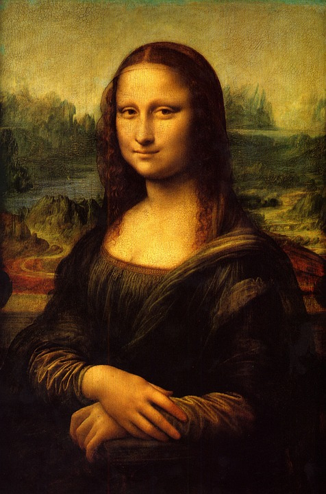
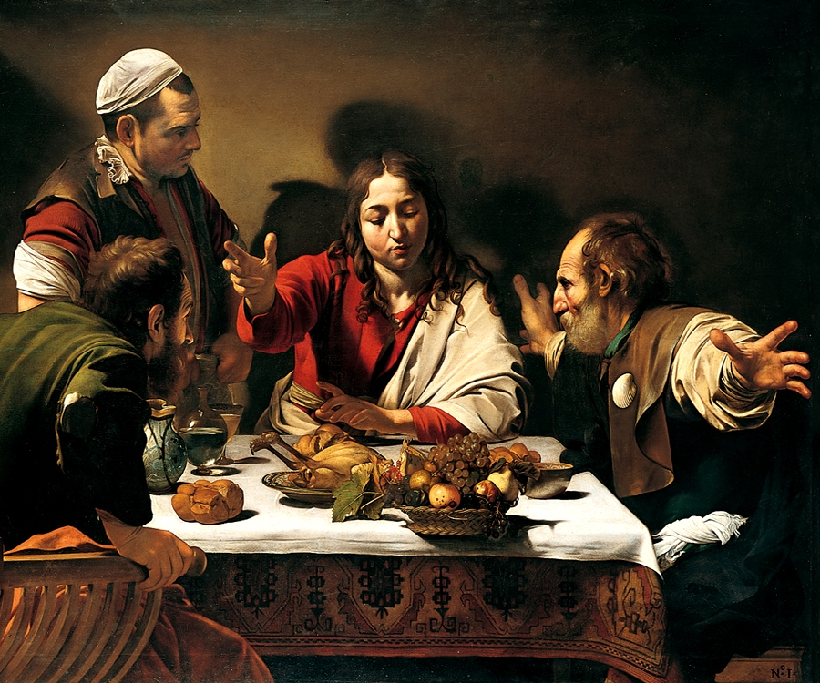
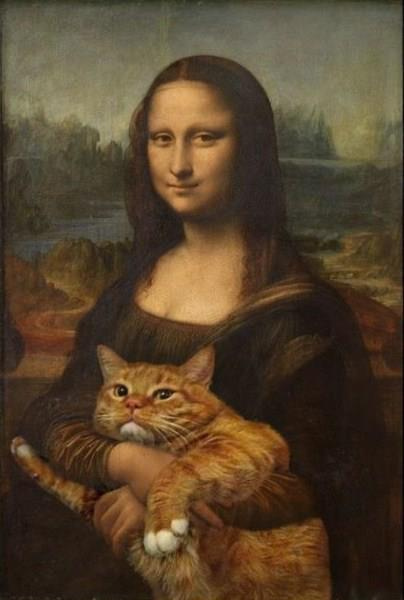

Image signatures and distances
==============================
Consider these two photographs of the `Mona Lisa`_:

.. image:: _images/MonaLisa_Wikipedia.jpg

(credit:
`Wikipedia <https://en.wikipedia.org/wiki/Mona_Lisa#/media/File:Mona_Lisa,_by_Leonardo_da_Vinci,_from_C2RMF_retouched.jpg>`__
Public domain)

(credit:
`WikiImages <https://pixabay.com/en/mona-lisa-painting-art-oil-painting-67506/>`_
Public domain)

Though it's obvious to any human observer that this is the same image, we can
find a number of subtle differences: the dimensions, palette, lighting and so
on are different in each image. ``image_match`` will give us numerical
comparison:

.. code-block:: python

    from image_match.goldberg import ImageSignature
    gis = ImageSignature()
    a = gis.generate_signature('https://upload.wikimedia.org/wikipedia/commons/thumb/e/ec/Mona_Lisa,_by_Leonardo_da_Vinci,_from_C2RMF_retouched.jpg/687px-Mona_Lisa,_by_Leonardo_da_Vinci,_from_C2RMF_retouched.jpg')
    b = gis.generate_signature('https://pixabay.com/static/uploads/photo/2012/11/28/08/56/mona-lisa-67506_960_720.jpg')
    gis.normalized_distance(a, b)

Returns ``0.22095170140933634``. Normalized distances of less than ``0.40`` are
very likely matches. If we try this again against a dissimilar image, say,
Caravaggio's `Supper at Emmaus <https://en.wikipedia.org/wiki/Supper_at_Emmaus_(Caravaggio),_London>`_:

(credit: `Wikipedia <https://en.wikipedia.org/wiki/Caravaggio#/media/File:Caravaggio_-_Cena_in_Emmaus.jpg>`__ Public domain)

against one of the Mona Lisa photographs:

.. code-block:: python

    c = gis.generate_signature('https://upload.wikimedia.org/wikipedia/commons/e/e0/Caravaggio_-_Cena_in_Emmaus.jpg')
    gis.normalized_distance(a, c)

Returns ``0.68446275381507249``, almost certainly not a match. ``image_match``
doesn't have to generate a signature from a URL; a file-path or even an
in-memory bytestream will do (be sure to specify ``bytestream=True`` in the
latter case).

Now consider this subtly-modified version of the Mona Lisa:

(credit: `Michael Russell <https://www.flickr.com/photos/planetrussell/6814444991>`_ `Attribution-ShareAlike 2.0 Generic <https://creativecommons.org/licenses/by-sa/2.0/>`_)

How similar is it to our original Mona Lisa?

.. code-block:: python

    d = gis.generate_signature('https://c2.staticflickr.com/8/7158/6814444991_08d82de57e_z.jpg')
    gis.normalized_distance(a, d)

This gives us ``0.42557196987336648``. So markedly different than the two
original Mona Lisas, but considerably closer than the Caravaggio.

.. _Mona Lisa: https://en.wikipedia.org/wiki/Mona_Lisa
